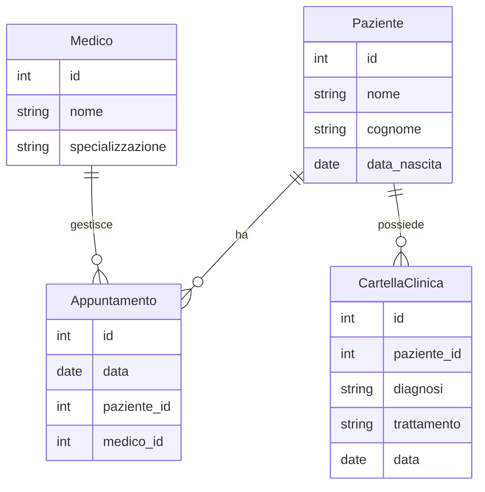

# MermaidERD

## Introduzione
**MermaidERD** descrive il modello di un sistema ERP (Enterprise Resource Planning) progettato per il settore sanitario. Questo progetto mira a migliorare l'efficienza gestionale delle strutture sanitarie attraverso l'integrazione di vari processi aziendali in un unico sistema coerente. Puoi visualizzare l'intero schema ERD [**qui**](https://frank4barb.github.io/MermaidERD/ERmodel.html).

## Descrizione del Progetto
**MermaidERD** utilizza uno schema ERD (Entity-Relationship Diagram) per rappresentare le relazioni tra le diverse entità coinvolte nel sistema sanitario. Lo schema è stato realizzato utilizzando Mermaid, uno strumento che permette di creare diagrammi e grafici in modo semplice e intuitivo utilizzando una sintassi markdown.

## Schema ERD
Lo schema ERD (Entity-Relationship Diagram) del progetto è stato realizzato utilizzando Mermaid. Mermaid è uno strumento che permette di creare diagrammi e grafici in modo semplice e intuitivo utilizzando una sintassi markdown.

### Contenuto del Modello
Il modello ERD di **MermaidERD** include le seguenti entità principali:

- **Prestazione**: Rappresenta le prestazioni sanitarie fornite ai pazienti. Contiene informazioni dettagliate come l'ID della prestazione, l'ID del paziente, l'ID dell'episodio, la data e l'ora della richiesta, la data e l'ora dell'esecuzione, il costo della prestazione e note varie.
- **TipoAttivita**: Descrive i vari tipi di attività sanitarie. Include campi come codice, descrizione, note, costo medio e durata.
- **RelPrestazioneCampione**: Rappresenta la relazione tra le prestazioni e i campioni. Contiene l'ID del campione, l'ID della prestazione, il tipo di campione e note.
- **RelPrestazioneUsa**: Descrive l'uso delle risorse nelle prestazioni. Include informazioni come l'ID della prestazione, il tipo di risorsa, la quantità usata e il costo.
- **Comune**: Contiene informazioni sui comuni, come codice, nome e note.
- **CategoriaDatoClinico**: Rappresenta le categorie di dati clinici. Include codice, descrizione e note.
- **TipoEpisodio**: Descrive i tipi di episodi clinici. Contiene codice, classe, descrizione e note.
- **Richiesta**: Rappresenta le richieste di prestazioni sanitarie. Include l'ID dell'unità richiedente, l'ID del paziente, la data e l'ora della richiesta, l'urgenza e lo stato della richiesta.
- **Episodio**: Descrive gli episodi clinici dei pazienti. Contiene informazioni come l'ID del paziente, il tipo di episodio, la data e l'ora di inizio e fine, e note varie.
- **Campione**: Rappresenta i campioni prelevati dai pazienti. Include l'ID del tipo di campione, la descrizione, la data e l'ora del prelievo, e lo stato del campione.
- **Organizzazione**: Descrive le unità organizzative del sistema sanitario. Include codice, descrizione, note, email e telefono.
- **Personale**: Rappresenta il personale sanitario. Contiene informazioni come codice, nome, cognome, codice fiscale, email e telefono.
- **TipoRichiesta**: Descrive i tipi di richieste sanitarie. Include codice, gruppo, descrizione e note.
- **TipoOrganizzazione**: Rappresenta i tipi di organizzazioni sanitarie. Include codice, descrizione e note.
- **TipoRisorsa**: Descrive i tipi di risorse utilizzate nelle prestazioni sanitarie. Include codice, classe della risorsa, descrizione e unità di misura.

### Diagramma ERD Semplificato

## Librerie utilizzate

- [Mermaid](https://github.com/mermaid-js/mermaid): Strumento JavaScript per creare e modificare diagrammi complessi utilizzando definizioni di testo ispirate a Markdown, aiutando la documentazione a tenere il passo con lo sviluppo.

---
Contribuisci o segnala problemi nel repository!
